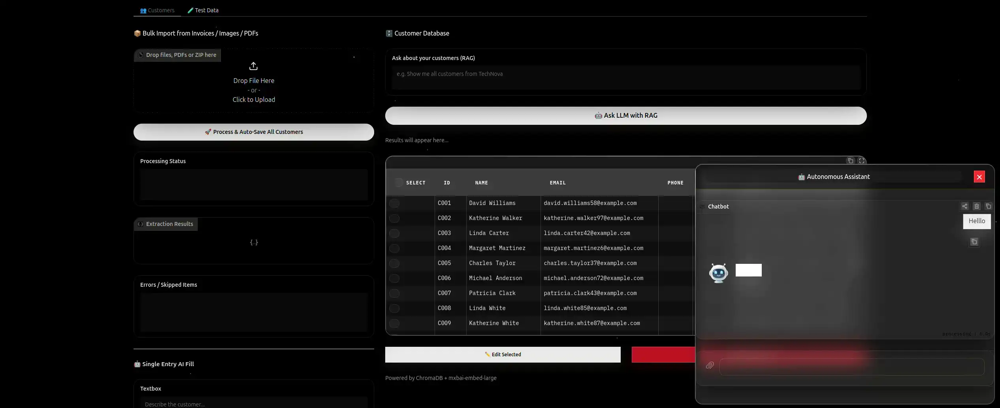

<p align="center">
  
  
  
  
  
</p>

<h1 align="center">🤖 Autonomous Business OS Demo</h1>
<p align="center">
  <em>AI-Powered Business Management with RAG, Vision Extraction & Cinematic UI</em>
</p>

---

## 🎬 Overview

**Autonomous Business OS Demo** is a fully local, AI-driven business management dashboard. It combines **Ollama LLMs**, **ChromaDB vector search**, and **LangChain RAG chains** into a polished Gradio interface with a cinematic dark theme.

Generate synthetic invoices, bulk-import customer data from images/PDFs via vision models, query your database with natural language, and chat with a floating AI assistant — all running 100% on your own hardware.

---

## ✨ Features

| Module | Capability |
|--------|------------|
| **👥 Customer Management** | CRUD operations with vector-semantic search via ChromaDB |
| **📄 Bulk Import** | Drag-and-drop ZIP, PDF, or images. Auto-extracts customer data using local vision models |
| **🧪 Test Data Generator** | Creates high-variation synthetic invoices (PDF + ZIP) with random Texas-style business data |
| **🔍 RAG Search** | Ask natural-language questions about your customers; LangChain RAG generates contextual answers |
| **💬 Floating AI Chat** | Toggleable multimodal chatbot (text + image + PDF) in the bottom-right corner |
| **🎨 Cinematic UI** | Dark glassmorphism theme with animated starfield background |

---

## 🏗️ Architecture
```
┌─────────────────────────────────────────┐
│         presentation/ (Gradio UI)       │
│  ┌─────────┐ ┌─────────┐ ┌──────────┐   │
│  │Customers│ │Test Data│ │  Chat    │   │
│  │  Tab    │ │  Tab    │ │(Floating)│   │
│  └────┬────┘ └────┬────┘ └────┬─────┘   │
│       └───────────┴───────────┘         │
│              application/               │
│    ┌─────────────┐  ┌─────────────┐     │
│    │CustomerSvc  │  │  ChatSvc    │     │
│    │(RAG + CRUD) │  │(Streaming)  │     │
│    └──────┬──────┘  └──────┬──────┘     │
│           └────────┬───────┘            │
│              infrastructure/            │
│    ┌─────────┐  ┌─────────────────┐     │
│    │ChromaDB │  │  OllamaClient   │     │
│    │(Vectors)│  │(LLM + Vision)   │     │
│    └─────────┘  └─────────────────┘     │
│              config/settings.py         │
└─────────────────────────────────────────┘
```
---

## 🚀 Quick Start

### Prerequisites

Your system needs these **OS-level libraries** before installing Python packages:

**Ubuntu / Debian**
```bash
sudo apt update
sudo apt install -y libpango1.0-0 libcairo2 poppler-utils
```

**macOS**
```bash
brew install pango cairo poppler
```

**Windows**
- Install [GTK+ for Windows](https://www.gtk.org/docs/installations/windows/) (for WeasyPrint)
- Install [Poppler for Windows](https://github.com/oschwartz10612/poppler-windows) and add `bin/` to your PATH

### 1. Clone & Setup

```bash
git clone https://github.com/RealRaven/AutonomousBusinessOS-Demo.git
cd AutonomousBusinessOS-Demo

# Create virtual environment
python3 -m venv .venv
# or: python -m venv .venv # Windows

# Activate
source .venv/bin/activate        # Linux/macOS
# or: .venv\Scripts\activate   # Windows

# Install dependencies
pip install -r requirements.txt
```

### 2. Configure Environment

```bash
cp .env.example .env
# Edit .env with your preferred editor
# or Edit config/settings.py
```

### 3. Start Ollama

Ensure Ollama is running locally with your chosen model:

```bash
ollama pull qwen3.5:4b
ollama pull mxbai-embed-large
ollama serve
```

### 4. Launch

```bash
python run.py
```

Open your browser at **`http://127.0.0.1:7860`**

---

## ⚙️ Configuration

Create a `.env` file in the project root. All values have sensible defaults.

| Variable | Default | Description |
|----------|---------|-------------|
| `OLLAMA_HOST` | `http://localhost:11434` | Ollama API endpoint |
| `OLLAMA_MODEL` | `qwen3.5:4b` | Main chat / extraction model |
| `OLLAMA_EMBEDDING_MODEL` | `mxbai-embed-large` | Embedding model for ChromaDB |
| `OLLAMA_TEMPERATURE` | `0.7` | LLM creativity |
| `OLLAMA_MAX_TOKENS` | `4096` | Max response length |
| `CHUNK_SIZE` | `1000` | Text splitter chunk size |
| `CHUNK_OVERLAP` | `200` | Text splitter overlap |
| `APP_TITLE` | `Autonomous Business OS Demo` | Browser tab title |

---

## 📁 Project Structure

```
autonomous-business-os/
├── config/
│   ├──__init__.py
│   ├── settings.py           # Frozen dataclass config with env var support
│   └── .env.example          # Template for local environment variables
├── core/
│   ├──__init__.py
│   └── models.py             # Customer dataclass with to_text() / to_dict()
├── application/
│   ├──__init__.py
│   ├── customer_service.py   # High-level CRUD + RAG business logic
│   └── chat_service.py       # Streaming chat with image/PDF support 
├── infrastructure/
│   ├──__init__.py
│   ├── database/
│   │   ├──__init__.py
│   │   └── chroma_client.py  # Low-level ChromaDB wrapper + LangChain embeddings
│   └── llm/
│       ├──__init__.py
│       └── ollama_client.py  # Centralized Ollama client (HTTP + LangChain LCEL)
├── presentation/
│   ├──__init__.py
│   ├── ui_manager.py         # Orchestrates tabs + floating chat
│   ├── styles.css            # Cinematic dark theme + glassmorphism
│   ├── tabs/
│   │   ├──__init__.py
│   │   ├── customers_tab.py  # Customer CRUD, bulk import, AI fill, RAG query
│   │   ├── test_data_tab.py  # Synthetic invoice PDF generator
│   │   └── chat_tab.py       # Floating multimodal chat interface
│   └── assets/
│       ├──__init__.py
│       └── img/
│           └── avatar.png      # AI assistant avatar (add your own)
├──__init__.py
├── run.py                    # Main entry point (Gradio Blocks + starfield JS)
├── requirements.txt
├── .gitignore
├── .env.example
├── pyproject.toml
├── LICENSE
└── README.md
```

---

## 🖼️ UI Preview

<p align="center">
   </img>
</p>


```
┌──────────────────────────────────────────────────────────────────────┐
│  ✨ Starfield Background            │  🤖 Floating Chat (toggle)     │
│                                     │     ┌─────────────┐            │
│  👥 Customers     │   🧪 Test       │     │  How can I  │            │
│  ─────────────    │    Data         │     │  help you?  │            │ 
│  [Bulk Upload]    │   [Generate]    │     └─────────────┘            │
│  [AI Fill]        │                 │                                │
│  [Table]          │                 │                                │
│  [RAG Query]      │                 │                                │
└──────────────────────────────────────────────────────────────────────┘
```

---

## 🛠️ Tech Stack

| Layer | Technology |
|-------|------------|
| **UI** | Gradio 6.x, Custom CSS (glassmorphism), HTML5 Canvas |
| **LLM** | Ollama (Qwen, Llama, etc.) |
| **Embeddings** | OllamaEmbeddings (`mxbai-embed-large`) |
| **Vector DB** | ChromaDB (persistent, cosine similarity) |
| **RAG** | LangChain LCEL ChatPromptTemplate \| ChatOllama \| StrOutputParser |
| **Vision** | Base64 image encoding + Ollama vision models |
| **PDF** | `pdf2image` (Poppler) + `weasyprint` (HTML→PDF) |
| **Config** | Python `dataclasses` + `os.getenv` |

---

## 📝 License

MIT License — see [LICENSE](LICENSE) for details.

---

## 🙋 FAQ

**Q: Does this work without internet?**  
Yes. Once models are pulled via Ollama, everything runs entirely locally.

**Q: Can I use a different LLM?**  
Absolutely. Change `OLLAMA_MODEL` in your `.env` to any model with vision capacity supported by Ollama.

**Q: Where is my data stored?**  
Locally in `./dbs/chroma/`. Nothing leaves your machine.

---

## 🙏 Acknowledgments

Built with **Gradio**, **LangChain**, **ChromaDB**, and **Ollama** — all running 100% locally on your hardware.
